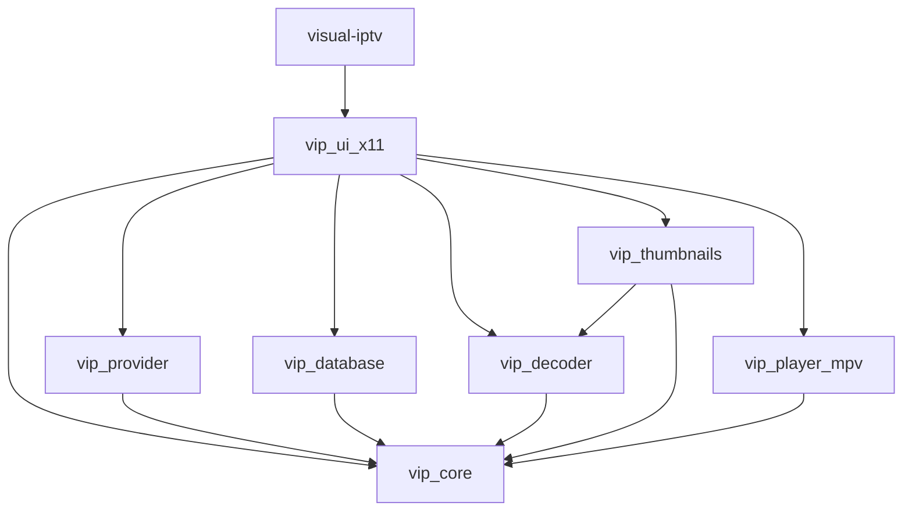
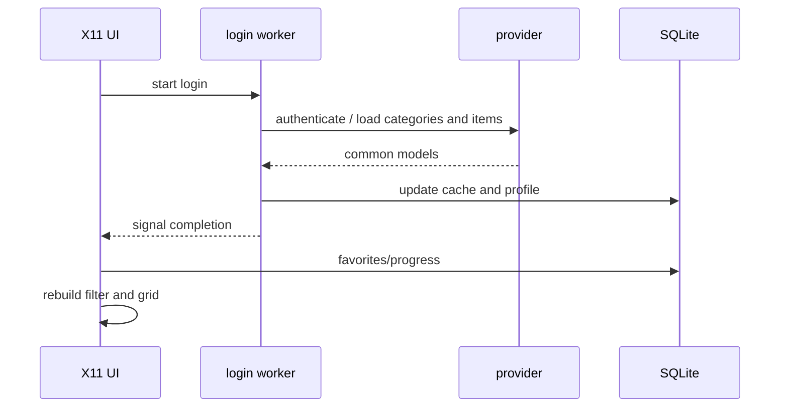

# Architecture

[Português (Brasil)](ARCHITECTURE.pt-BR.md)

## Goal

Blazzing is a C17/X11 application divided into small domain modules and an integration layer in `src/ui_x11/x11_app.c`. The UI does not implement the Xtream protocol, SQL, video decoding, or JSON IPC directly; it coordinates the corresponding APIs.

## Internal dependencies



### `vip_core`

Shared types, errors, ownership rules, dynamic lists, and credential normalization. `provider_id` identifies an account (`server + username`) so favorites and playback progress from different accounts on the same host do not collide.

### `vip_provider`

`src/provider/xtream.c` wraps libcurl/json-c and converts Xtream responses into `vip_category_list_t`, `vip_channel_list_t`, and `vip_media_metadata_t`.

`src/provider/m3u.c` loads a local file or an HTTP(S) playlist, parses `#EXTINF`, groups, and logos, and resolves relative URLs against the playlist origin.

### `vip_database`

SQLite stores the cached catalog, non-secret profiles, favorites, thumbnail metadata, per-item progress, aggregated series progress, and rich metadata. Initialization is idempotent and performs migrations compatible with existing databases.

### `vip_decoder`

A small interface for capturing one RGB frame. The current backend launches FFmpeg directly with argv, without invoking a shell. The child process writes RGB data through a pipe, has a timeout, and rejects low-value frames.

### `vip_thumbnails`

Concurrent scheduler backed by a priority heap. A map keyed by `provider_id + item_id` deduplicates jobs; generations invalidate old heap nodes when a job is reprioritized or cancelled. The current UI uses four workers.

JPEG/PNG/WebP artwork is downloaded and decoded directly. FFmpeg frame capture is a fallback. The final result is stored as JPEG in the cache.

### `vip_player_mpv`

Keeps a single mpv process alive with `--idle=yes`. Commands and media are sent through JSON IPC over a Unix socket. A monitor tracks events/properties and publishes a thread-safe snapshot to the UI.

### `vip_ui_x11`

Responsible for Xlib, screens, input, the catalog grid, details panel, login/series/metadata jobs, Secret Service integration, player integration, and periodic playback-progress persistence.

## Login and catalog flow



Network operations do not block the X11 event loop.

## Player and X11 composition

mpv is responsible for rendering. Blazzing does not copy video frames.

```text
main window (a->win)
├── video_win                 InputOutput: visual container
│   └── native mpv window     created by mpv and reparented
└── player_input_win          InputOnly: mouse/HUD over video area
```

Flow:

1. `vip_mpv_player_create()` stores the XID of `video_win`.
2. On the first `loadfile`, the backend starts mpv without `--wid`.
3. The monitor connects to the JSON IPC socket.
4. The backend searches the X11 tree for a window whose `_NET_WM_PID` matches the mpv PID.
5. The discovered window is reparented into `video_win`.
6. The monitor keeps size and position synchronized.
7. `player_input_win`, an X11 `InputOnly` window, stays above the video area so mouse movement and clicks reach the UI without covering mpv pixels.
8. The UI restores focus only when focus enters the application's internal player subtree; real application switches are left to the window manager.

## JSON IPC

The mpv command line does not contain the media URL. The URL is sent after IPC connection through the `loadfile` command.

The backend observes properties including:

- `pause`;
- `time-pos`;
- `duration`;
- `percent-pos`;
- `paused-for-cache`;
- `seekable`;
- `volume`;
- cache duration;
- codec, width, and height;
- VO and hwdec.

All socket writes pass through a mutex so JSON objects produced by different threads cannot interleave.

## Concurrency

Current threads:

- main X11 thread;
- login/catalog worker;
- seasons/episodes worker;
- metadata worker;
- 4 thumbnail-scheduler workers;
- mpv monitor.

Important rules:

- Xlib and drawing belong to the main thread.
- Workers publish results through mutex/atomic-protected state.
- The mpv backend protects its snapshot with a mutex and serializes IPC writes separately.
- The thumbnail scheduler may be paused during playback to reduce CPU/network competition.

## Data and IDs

The same `vip_channel_t` model represents live TV, VOD, series, and episodes. The historical name avoids duplicating structures and simplifies favorites, cache, and progress handling.

Relevant persistent keys combine `provider_id` with the item ID. This keeps accounts and providers isolated even when their internal IDs overlap.

## Playback progress

VOD items and episodes store position, duration, completion status, and timestamp. The UI writes periodically and forces persistence on important events. An item may be marked complete after natural EOF, approximately 95% playback, or when sufficiently close to the end.

Series also maintain an aggregated record with the most recent episode and watched count.

## Failover

Xtream profiles may include an alternate host. When the primary host fails, the UI rebuilds an equivalent URL by replacing only the normalized server prefix while preserving the Xtream path of the current item.
