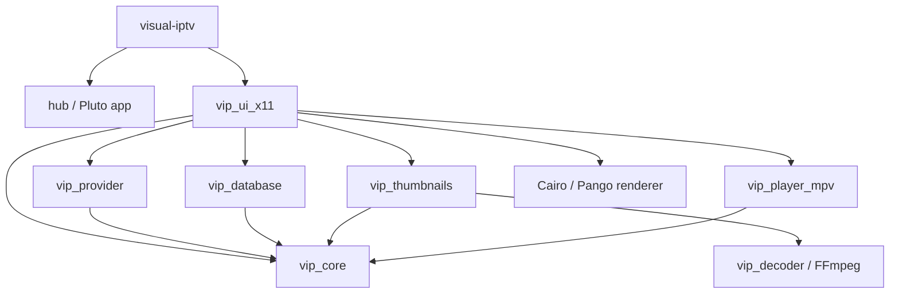
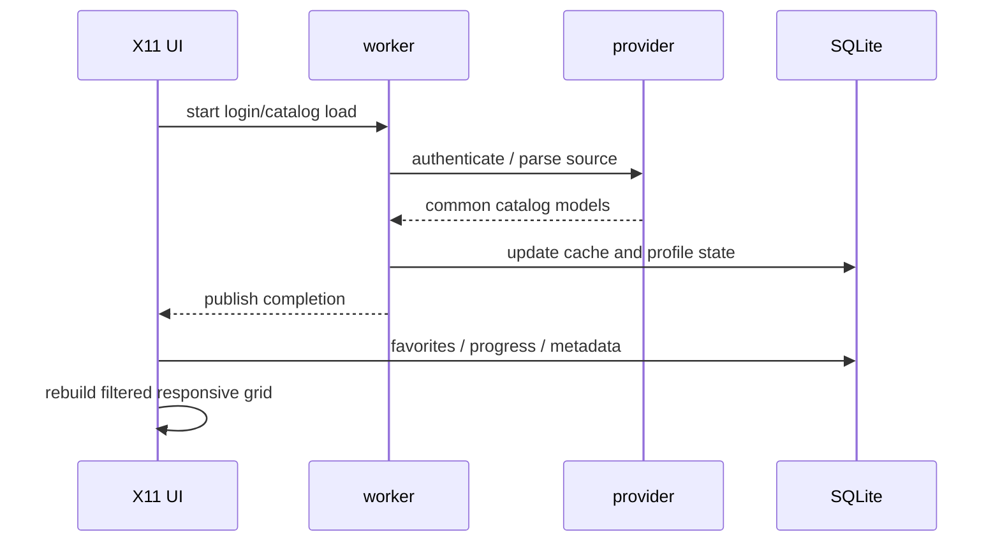

# Architecture

[Português (Brasil)](ARCHITECTURE.pt-BR.md)

## Scope

Blazzing is a C17 desktop application with a native X11 interface. On a Wayland desktop it runs through XWayland; there is no native Wayland rendering backend.

The feature set is frozen at v1.3.0. This document describes the architecture that is maintained for bug, security and compatibility fixes.

## Module graph



### `vip_core`

Owns shared status/error types, credentials, common catalog models and dynamic-list ownership rules. A `provider_id` identifies an account rather than only a host so favorites, progress and cached data from different accounts do not collide.

### `vip_provider`

Contains three source families:

- **Xtream Codes**: authentication, live/VOD/series catalogs, media metadata and series episodes;
- **M3U/M3U8**: local or HTTP(S) playlist loading, `#EXTINF` parsing, relative-URL resolution, content classification and inferred series/season grouping;
- **Pluto TV**: bootstrap/session data, channel catalog and stream URL construction.

The provider layer converts external payloads into the shared core models before the UI sees them.

### `vip_database`

SQLite stores non-secret profiles, cached catalog data, favorites, thumbnail metadata, playback progress, aggregated series progress and rich media metadata. Initialization and migrations are designed to be idempotent.

### `vip_decoder`

Provides a small RGB-frame capture interface. The current implementation launches FFmpeg directly with argv rather than through a shell, reads raw RGB from a pipe, enforces timeouts and rejects low-value candidate frames.

### `vip_thumbnails`

Uses a bounded concurrent scheduler and priority queue. Jobs are deduplicated by provider/item identity and can be reprioritized or invalidated without allowing stale work to overwrite newer state.

Provider artwork is decoded directly as JPEG, PNG or WebP. FFmpeg stream-frame capture is a fallback. Successful output is cached on disk as JPEG.

### `vip_ui_x11`

Owns the main IPTV window, X11 events, input, catalog layout, search, categories, login/profile screens, metadata/details, series navigation and the player HUD.

Cairo/Pango is used for antialiased surfaces and UTF-8 proportional typography. Xlib still owns windows, events and the backing surfaces.

### `vip_player_mpv`

Keeps one mpv process alive with `--idle=yes`. The XID of the application's `video_win` is passed to mpv through `--wid`; mpv therefore renders directly into that X11 child window.

Media URLs are **not** placed in mpv's argv. After the private Unix JSON IPC socket is connected, playback uses the `loadfile` command. A monitor thread consumes mpv events and observed properties and publishes a thread-safe snapshot.

## Login and catalog flow



Network access and heavy image work stay outside the X11 event loop.

## Series model

Xtream series already arrive as series-level entries. Opening one loads its season/episode information and presents a season-first view.

M3U playlists may expose each episode as an independent entry. The M3U catalog layer recognizes supported episode naming patterns, groups entries by inferred series, creates a series card and then exposes seasons and episodes below it.

## Video composition

```text
main X11 window (a->win)
├── video_win          InputOutput child passed to mpv with --wid
└── player_input_win   InputOnly overlay for Blazzing mouse/HUD input
```

Blazzing does not decode or copy normal playback frames into the UI. mpv owns the video pipeline and renders into `video_win`.

The input overlay lets Blazzing receive pointer interaction over the video area without becoming the video renderer.

## JSON IPC

The mpv backend uses a private Unix-domain socket. Writes are serialized with a dedicated mutex so commands from different threads cannot interleave.

The monitor tracks state including:

- pause/playback state;
- position and duration;
- seekability and buffering;
- volume;
- video codec and dimensions;
- active VO and hardware-decoding state;
- end-file/error events.

Diagnostic text is sanitized before retained URL-shaped data can reach the in-memory recent log.

## Concurrency

The important long-lived execution contexts are:

- the main X11/UI thread;
- login/catalog worker;
- season/episode worker;
- metadata worker;
- thumbnail workers;
- mpv monitor thread.

Rules:

- X11 drawing and normal UI state transitions belong to the main thread;
- background jobs publish results through mutex/atomic-protected state;
- mpv snapshot state and IPC writes use separate synchronization;
- thumbnail work is bounded and may be reduced while playback is active.

## Persistence and identifiers

The same `vip_channel_t` model represents live channels, movies, series cards and episodes. Persistent keys combine provider/account identity with item IDs so independent sources remain isolated.

VOD and episodes store position, duration, completion state and timestamps. Series keep aggregate progress such as latest episode and watched count.

## Security and privacy boundaries

- Xtream passwords are not persisted in SQLite.
- Secret Service is used through `secret-tool` when available.
- mpv receives media URLs over JSON IPC rather than process arguments.
- retained mpv diagnostics redact URL-shaped spans.
- FFmpeg is executed directly without a command shell.

See [Data and privacy](DATA_AND_PRIVACY.md).

## Phone pairing

```text
Phone browser --HTTPS--> Cloudflare Worker <--HTTPS polling-- Blazzing
      |                       |                             |
      |                 Durable Object                     |
      |                 ciphertext only                    |
      +---- AES-256-GCM key comes from QR #fragment -------+
```

The old inbound LAN HTTP server is not part of the current architecture.
Pairing uses outbound HTTPS from both endpoints. The Worker owns the temporary encrypted session state; no VPS is part of the architecture.
