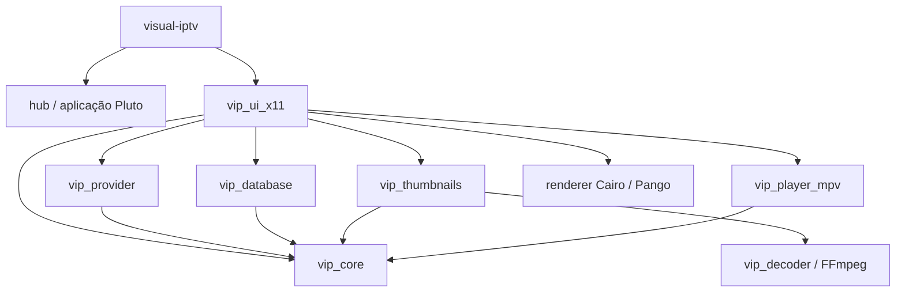
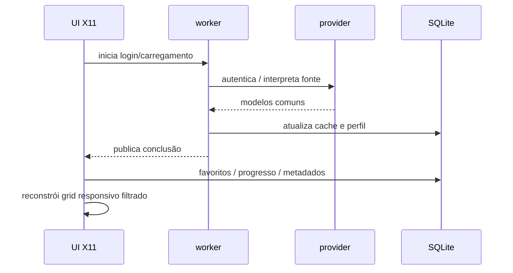

# Arquitetura

[English](ARCHITECTURE.md)

## Escopo

O Blazzing é uma aplicação desktop C17 com interface X11 nativa. Em um desktop Wayland ele roda através do XWayland; não existe backend gráfico Wayland nativo.

O conjunto de recursos está congelado na v1.3.0. Este documento descreve a arquitetura mantida para correções de bugs, segurança e compatibilidade.

## Grafo de módulos



### `vip_core`

Mantém tipos compartilhados de status/erro, credenciais, modelos comuns do catálogo e regras de ownership das listas dinâmicas. O `provider_id` identifica uma conta, e não apenas o host, para impedir colisões de favoritos, progresso e cache entre contas.

### `vip_provider`

Contém três famílias de fontes:

- **Xtream Codes**: autenticação, catálogos de TV/VOD/séries, metadados e episódios;
- **M3U/M3U8**: carregamento local ou HTTP(S), parsing de `#EXTINF`, resolução de URLs relativas, classificação de conteúdo e agrupamento inferido de séries/temporadas;
- **Pluto TV**: bootstrap/sessão, catálogo de canais e construção das URLs de stream.

O provider transforma os payloads externos nos modelos comuns antes de entregá-los à UI.

### `vip_database`

O SQLite guarda perfis sem segredo, catálogo em cache, favoritos, metadados de thumbnails, progresso, progresso agregado de séries e metadados ricos. Inicialização e migrações são projetadas para serem idempotentes.

### `vip_decoder`

Oferece uma interface pequena para captura de frame RGB. O backend atual inicia FFmpeg diretamente com argv, sem shell, lê RGB bruto por pipe, aplica timeout e rejeita frames candidatos pouco úteis.

### `vip_thumbnails`

Usa scheduler concorrente limitado e fila de prioridade. Jobs são deduplicados pela identidade provider/item e podem ser repriorizados ou invalidados sem permitir que trabalho obsoleto sobrescreva estado mais novo.

Artwork do provider é decodificado diretamente como JPEG, PNG ou WebP. Captura de frame via FFmpeg é fallback. O resultado é salvo no cache em JPEG.

### `vip_ui_x11`

É responsável pela janela principal IPTV, eventos X11, input, layout do catálogo, busca, categorias, login/perfis, detalhes/metadados, navegação de séries e HUD do player.

Cairo/Pango renderiza superfícies antialiasadas e tipografia UTF-8 proporcional. Xlib continua responsável por janelas, eventos e superfícies base.

### `vip_player_mpv`

Mantém um processo mpv persistente com `--idle=yes`. O XID do `video_win` da aplicação é passado diretamente ao mpv por `--wid`; portanto o próprio mpv renderiza dentro dessa janela filha X11.

URLs de mídia **não** entram no argv do mpv. Depois que o socket Unix privado de JSON IPC conecta, a reprodução usa o comando `loadfile`. Uma thread de monitor consome eventos/propriedades e publica um snapshot thread-safe.

## Fluxo de login e catálogo



Rede e processamento pesado de imagens ficam fora do event loop X11.

## Modelo de séries

Séries Xtream já chegam como entradas de série. Ao abrir uma delas, o Blazzing carrega temporadas/episódios e mostra primeiro a seleção de temporada.

Listas M3U podem expor cada episódio como item independente. A camada de catálogo M3U reconhece os padrões de episódio suportados, agrupa pelo nome inferido da série, cria um card único e depois expõe temporadas e episódios abaixo dele.

## Composição de vídeo

```text
janela X11 principal (a->win)
├── video_win          filha InputOutput passada ao mpv por --wid
└── player_input_win   overlay InputOnly para mouse/HUD do Blazzing
```

O Blazzing não decodifica nem copia os frames normais de reprodução para a UI. O mpv é dono do pipeline de vídeo e renderiza em `video_win`.

O overlay de input permite que o Blazzing receba interação de ponteiro sobre a área de vídeo sem virar o renderer do vídeo.

## JSON IPC

O backend mpv usa um socket Unix privado. Escritas são serializadas por um mutex dedicado para impedir interleaving de comandos enviados por threads diferentes.

O monitor acompanha, entre outros:

- pause/estado de reprodução;
- posição e duração;
- seekability e buffering;
- volume;
- codec e dimensões do vídeo;
- VO e hardware decoding ativos;
- eventos de fim/erro.

Texto de diagnóstico é sanitizado antes que trechos com formato de URL possam ser mantidos no log recente em memória.

## Concorrência

Os contextos de execução duradouros mais importantes são:

- thread principal X11/UI;
- worker de login/catálogo;
- worker de temporadas/episódios;
- worker de metadados;
- workers de thumbnails;
- thread de monitor do mpv.

Regras:

- desenho X11 e transições normais de estado da UI ficam na thread principal;
- jobs de fundo publicam resultados através de estado protegido por mutex/atomics;
- snapshot do mpv e escritas IPC usam sincronização separada;
- trabalho de thumbnails é limitado e pode ser reduzido durante reprodução.

## Persistência e IDs

O mesmo `vip_channel_t` representa canais ao vivo, filmes, cards de série e episódios. Chaves persistentes combinam identidade do provider/conta com ID do item para manter fontes independentes isoladas.

VOD e episódios guardam posição, duração, conclusão e timestamps. Séries mantêm progresso agregado, incluindo episódio mais recente e quantidade assistida.

## Limites de segurança e privacidade

- senhas Xtream não são persistidas no SQLite;
- Secret Service é usado via `secret-tool` quando disponível;
- mpv recebe URLs por JSON IPC, não por argumentos do processo;
- diagnósticos retidos do mpv ocultam trechos com formato de URL;
- FFmpeg é executado diretamente, sem shell.

Veja [Dados e privacidade](DATA_AND_PRIVACY.pt-BR.md).

## Pareamento pelo celular

```text
Navegador --HTTPS--> Cloudflare Worker <--polling HTTPS-- Blazzing
     |                       |                               |
     |                 Durable Object                       |
     |                 apenas ciphertext                    |
     +---- chave AES-256 vem do fragmento # do QR ----------+
```

O servidor HTTP LAN de entrada antigo não faz parte da arquitetura atual. Os
dois lados usam somente conexões HTTPS de saída. O Worker mantém o estado cifrado temporário da sessão; não há VPS nessa arquitetura.
