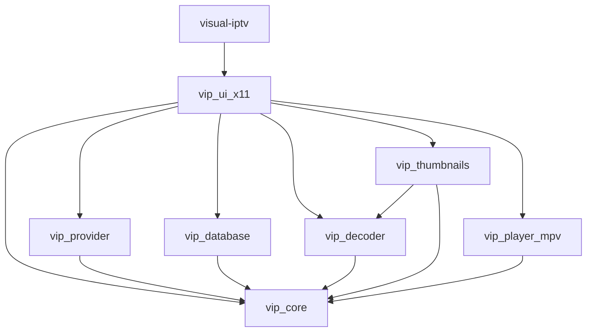
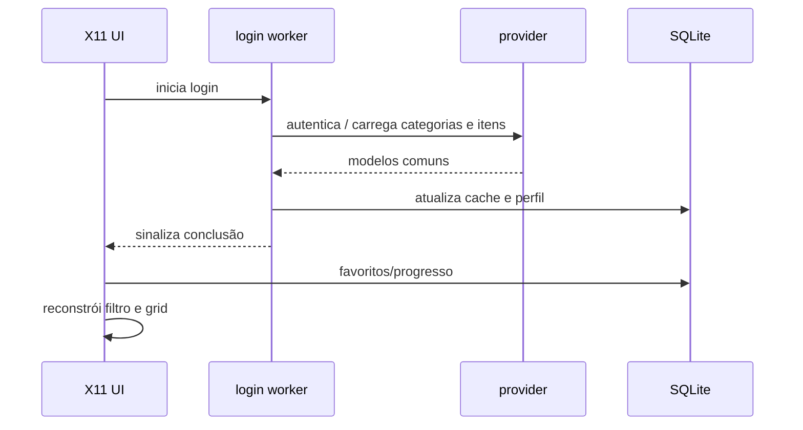

# Arquitetura

[English](ARCHITECTURE.md)

## Objetivo

Blazzing é uma aplicação C17/X11 dividida em módulos pequenos de domínio e uma camada de integração em `src/ui_x11/x11_app.c`. A UI não implementa protocolo Xtream, SQL, decode de vídeo ou JSON IPC diretamente; ela coordena as APIs correspondentes.

## Dependências internas



### `vip_core`

Tipos compartilhados, erros, ownership, listas dinâmicas e normalização de credenciais. `provider_id` identifica a conta (`servidor + usuário`) para impedir colisão de favoritos e progresso entre contas no mesmo host.

### `vip_provider`

`src/provider/xtream.c` encapsula libcurl/json-c e transforma respostas Xtream em `vip_category_list_t`, `vip_channel_list_t` e `vip_media_metadata_t`.

`src/provider/m3u.c` carrega arquivo local ou HTTP(S), interpreta `#EXTINF`, grupos e logos e resolve URLs relativas contra a origem da playlist.

### `vip_database`

SQLite centraliza catálogo em cache, perfis não secretos, favoritos, metadata de thumbnail, progresso individual, progresso de série e metadata rica. A inicialização é idempotente e realiza migrações compatíveis com bancos existentes.

### `vip_decoder`

Interface pequena para captura de um frame RGB. O backend atual inicia FFmpeg diretamente com argv, sem shell. O processo escreve RGB por pipe, possui timeout e filtra frames pouco úteis.

### `vip_thumbnails`

Scheduler concorrente baseado em heap de prioridade. Um mapa por `provider_id + item_id` deduplica jobs; gerações invalidam nós antigos do heap quando um job é repriorizado/cancelado. Quatro workers são usados pela UI atual.

Artwork JPEG/PNG/WebP é baixado e decodificado diretamente. Captura com FFmpeg é fallback. O resultado final é salvo como JPEG no cache.

### `vip_player_mpv`

Mantém um único processo mpv em `--idle=yes`. Comandos e mídia são enviados por JSON IPC em socket Unix. O monitor observa eventos/propriedades e publica um snapshot thread-safe para a UI.

### `vip_ui_x11`

Responsável por Xlib, telas, input, grid, painel de detalhes, jobs de login/séries/metadados, integração com Secret Service, player e persistência periódica de progresso.

## Fluxo de login e catálogo



Operações de rede não bloqueiam o event loop X11.

## Player e composição X11

O mpv é responsável pelo rendering. Não existe cópia de frames de vídeo pelo Blazzing.

```text
janela principal (a->win)
├── video_win                 InputOutput: container visual
│   └── janela nativa mpv     criada pelo mpv e reparentada
└── player_input_win          InputOnly: mouse/HUD sobre a área do vídeo
```

Fluxo:

1. `vip_mpv_player_create()` guarda o XID do `video_win`.
2. No primeiro `loadfile`, o backend inicia mpv sem `--wid`.
3. O monitor conecta ao socket JSON IPC.
4. O backend procura na árvore X11 uma janela cujo `_NET_WM_PID` é o PID do mpv.
5. A janela encontrada é reparentada para `video_win`.
6. O monitor mantém tamanho/posição sincronizados.
7. `player_input_win`, uma janela X11 `InputOnly`, permanece acima da área de vídeo para entregar movimentos e cliques à UI sem cobrir os pixels do mpv.
8. A UI recupera foco apenas quando ele entra na subárvore interna do player; mudanças reais de aplicação são deixadas para o window manager.

## JSON IPC

A linha de comando do mpv não contém a URL da mídia. A URL é enviada depois da conexão pelo comando `loadfile`.

Todas as escritas no socket passam por um mutex para impedir interleaving de objetos JSON provenientes de threads diferentes.

## Concorrência

Threads atuais:

- thread X11 principal;
- worker de login/catálogo;
- worker de temporadas/episódios;
- worker de metadados;
- 4 workers do scheduler de thumbnails;
- monitor do mpv.

Xlib e desenho pertencem à thread principal. Workers publicam resultados em estado protegido por mutex/atomics.

## Dados e IDs

As chaves persistentes relevantes usam `provider_id` junto do ID do item para separar contas e provedores mesmo quando IDs internos coincidem.

## Progresso

VOD e episódios armazenam posição, duração, conclusão e timestamp. Séries mantêm também um registro agregado com último episódio e contagem assistida.

## Failover

Perfis Xtream podem ter host alternativo. Quando o primário falha, a UI reconstrói a URL equivalente substituindo apenas o prefixo normalizado do servidor e preservando o caminho Xtream do item atual.
